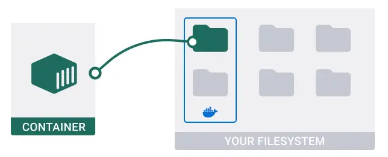
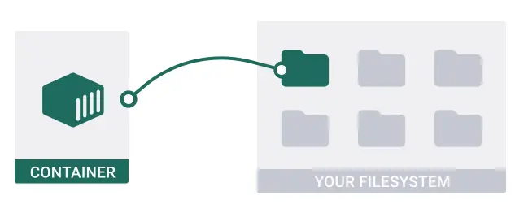

# Docker
Docker is a platform that packages applications into isolated environments called containers.

- [Dockerfile](#dockerfile)
  - [What does `COPY . .` do???](#what-does-copy---do)
- [Docker Commands](#docker-commands)
- [Containerize](#containerize)
- [Volumes](#volumes)
  - [Use Cases](#use-cases)
  - [Example](#example)
- [Bind Mounts](#bind-mounts)
  - [Use Cases](#use-cases-1)
  - [Example](#example-1)


## Dockerfile
A Dockerfile defines an image (the blueprint of a container).

Example:

```Dockerfile
# Specify the base image
FROM python:3.8

# Set the working directory of Docker container
WORKDIR /app

# Copy the dependency file
COPY requirements.txt .

# Install dependencies
RUN pip install -r requirements.txt

# Copy the application code
COPY . .

# Run the application
CMD ["python", "app.py"]
```

### What does `COPY . .` do???

The `COPY . .` directive copies everything from build context into the WORKDIR inside the container.

The **build context** is the directory on your local environment where the docker build command is executed to build a Docker image. It's also the directory where the Dockerfile exists.

The **WORKDIR** is the container image's working directory.

Here, the first `.` denotes the build context, and the second `.` refers to the working directory inside the container.


## Docker Commands

- **Build Image**:
  ```bash
  docker build -t [image-name]:[tag] .
  ```
  Build a custom Docker image from a Dockerfile in the current directory.

- **Run Container**:
  ```bash
  docker run -d -p [host-port]:[container-port] [image-name]:[tag]
  ```
  Start a container from an image.

- **List Containers**:
  ```bash
  docker ps
  ```
  Show running containers. Use `-a` to show all containers.

- **Stop Container**:
  ```bash
  docker stop [container-id or name]
  ```
  Stop a running container.

- **Remove Container**:
  ```bash
  docker rm [container-id or name]
  ```
  Delete a stopped container.

- **List Images**:
  ```bash
  docker images
  ```
  Display all local images.

- **Remove Image**:
  ```bash
  docker rmi [image-id]
  ```
  Delete a local image.

## Containerize


## Volumes

Volumes are Docker-managed data persistence mechanisms, isolated from the host filesystem. Managed by Docker, they allow for easy data backups and transfers, independent of container lifecycles.



### Use Cases
Volumes are suitable for data persistence and backups.

### Example
To persist MongoDB data, create the `mongodb_data` volume for MongoDB and mounts it at `/data/db` in the container.

```yaml
services:
  mongodb:
    image: mongo:latest
    volumes:
      - mongodb_data:/data/db
    ports:
      - "27017:27017"
volumes:
  mongodb_data: # The name of the volume.
```

## Bind Mounts

Bind mounts link a specific file or directory on the host machine to a path in the container's filesystem. It allows the container to access host files/directories directly and ensures data persistence outside the container.



### Use Cases
Bind mounts are useful during development for quick reflections of host system files in a container.

### Example
To store MongoDB data in the `./mongodb_data` directory on the host, mounts it from the host to `/data/db` in the container.

```yaml
services:
  mongodb:
    image: mongo:latest
    volumes:
      - ./mongodb_data:/data/db
    ports:
      - "27017:27017"
```

