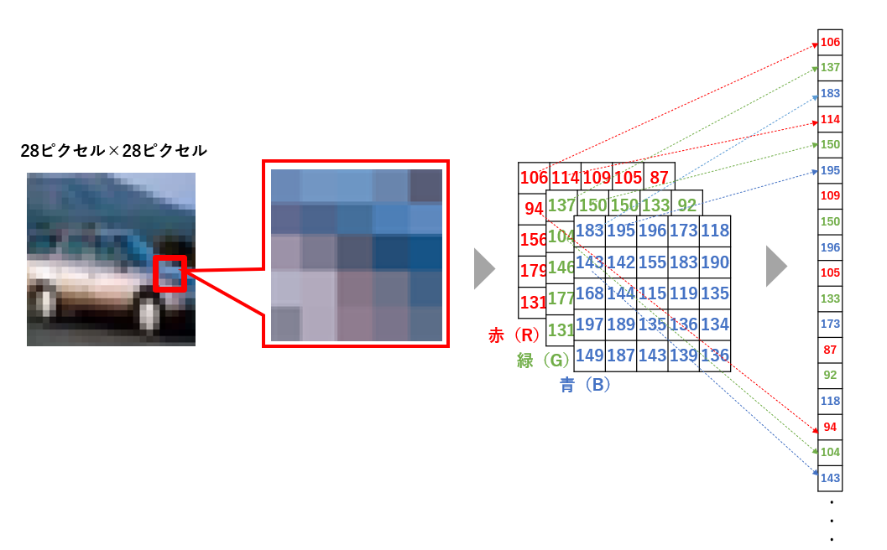
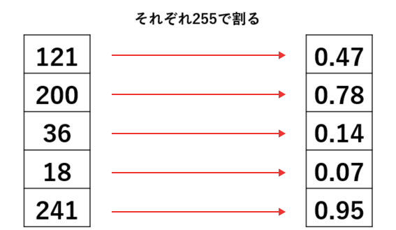
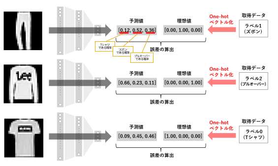

# TensorFlow $ Keras

- [TensorFlow](#tensorflow)
- [Keras](#keras)
- [ニューラルネットワーク構築の流れ](#ニューラルネットワーク構築の流れ)
  - [1. データの取得](#1-データの取得)
  - [2. データの前処理](#2-データの前処理)
  - [3. ニューラルネットワーク構造の定義](#3-ニューラルネットワーク構造の定義)
  - [4. 損失関数、最適化アルゴリズムの設定](#4-損失関数最適化アルゴリズムの設定)
  - [5. ニューラルネットワークの学習](#5-ニューラルネットワークの学習)
  - [6. ニューラルネットワークの評価](#6-ニューラルネットワークの評価)
  - [7. 予測](#7-予測)

## TensorFlow
TensorFlowとは、Googleが開発したオープンソースの機械学習ライブラリ。
ニューラルネットワークや畳み込みニューラルネットワークなど、予測モデルを構築するための機能を提供。
主に画像認識、自然言語処理、音声認識などに関する開発で使用されている。　

## Keras
Kerasは、シンプルで直感的にニューラルネットワークを構築し、学習できるライブラリ。
もともと独立したライブラリとして開発されたが、2017年にTensorFlowへ統合。
tf.kerasモジュールと呼ばれるTensorFlowの1つの機能として利用可能。

## ニューラルネットワーク構築の流れ

### 1. データの取得

ExcelファイルやCSVファイル、画像ファイル、Kerasが提供しているサンプルデータなどからデータを取得する。

データの取得元は、構築するニューラルネットワークの目的によって異なる。取得したデータは、学習用と評価用に分割される。

### 2. データの前処理

予測モデルの学習や評価に利用できるように、データを事前修正する作業をデータの前処理という。前処理には、データの欠損を補完する作業や、表記ゆれを統一する修正などが含まれる。

画像データの前処理には以下のようなものがある。

- データの次元変更

ニューラルネットワークは、その構造によって、入力できるデータの形状が決まっています。例えば、ニューラルネットワークの入力層のノード数が784個ある場合、入力データは「784種の要素を持つデータ」である必要があります。

image

画像データは多次元のデータ構造を持っているため、NNに投入する前にデータの次元を変更する必要がある。カラー画像のデータは、「縦ピクセル数」×「横ピクセル数」×「3チャネル（R・G・B）」の3次元構造で形成されている。各要素は0から255の数値で、赤・緑・青の色の強さを表現する。この3次元の数値データは、以下のように、1次元の数値配列に変換できる。

モノクロ画像の場合はチャネルが1種類（白黒の濃度）のため、「縦ピクセル数」×「横ピクセル数」×「1チャネル」から1次元データに次元変更する。

例えば、入力データである画像が、32ピクセル×32ピクセルのカラー画像の場合、ニューラルネットワークの入力層のノード数は、32×32×3=3072となる。

- 画像データのスケーリング

画像データを構成している各数値を255で割り、0から1の範囲の値に変換する。取り扱う数値の範囲が大きすぎる場合、学習プロセスがうまく機能しないことがあるため、スケーリングは、学習プロセスを安定させる効果があるらしい。

- One-hotベクトル化

あるカテゴリを表すための、0と1のみで構成される1次配列をOne-hotベクトルという。

例えば、取得したデータにおいて、Tシャツは「0」、ズボンは「1」、プルオーバーが「2」というラベルで表現されているとしよう。One-hotベクトル化ではこのラベルを以下のように変更する。

|データ|取得したデータのラベル|One-hotベクトル|
|-|-|-|
|Tシャツ    |0|[1, 0, 0]|
|ズボン     |1|[0, 1, 0]|
|プルオーバー|2|[0, 0, 1]|

学習プロセスにおいて、予測値と理想値から誤差を算出するためにOne-hotベクトル化が必要になる。

例えば、ある画像を読み込んで「Tシャツである確率」「ズボンである確率」「プルオーバーである確率」を予測するニューラルネットワークの学習をイメージしよう。ニューラルネットワークから出力される予測値は、0から1の値で確率を表す3つの数値配列。その画像が実際に何であるかという答え、つまり最初のステップで取得したデータのラベルを、ニューラルネットワークから出力された予測値の形式に併せて誤差を算出する。この手段として、One-hotベクトル化が利用されます。

### 3. ニューラルネットワーク構造の定義
データの前処理が完了したら、以下のようなニューラルネットワーク構造の定義を行う。

- 入力層のノード数
- 隠れ層の層数
- 各隠れ層のノード数
- 各隠れ層の活性化関数
- 出力層のノード数
- 出力層の活性化関数

参考：[jp_deep_learning.md - ニューラルネットワークの構造デザイン](jp_deep_learning.md#nn構造の設計)

### 4. 損失関数、最適化アルゴリズムの設定

ニューラルネットワークの学習を実施するために、損失関数と最適化アルゴリズムを設定する。

- 損失関数とは

損失関数とは、学習プロセスにおいて、予測モデルが出力した予測値と、出力してほしい理想値の差を評価するための関数。誤差関数や目的関数と呼ばれる。

| 損失関数 | 計算方法 | 用途の例 |
|--------|-------|----|
| 平均二乗誤差     | 予測値と理想値の差の、二乗の平均で誤差を計算する| 売上予測や客数予測 |
| 平均絶対誤差     | 予測値と理想値の差の、絶対値の平均で誤差を計算する | 売上予測や客数予測|
| エントロピー誤差 ※ | 予測値と理想値の誤差を、自然対数（log）を利用して計算する | A or B or Cといったカテゴリを判定する場合。|

※ 分類するカテゴリの数が2つの場合「二値交差エントロピー誤差」、3つ以上の場合「カテゴリ交差エントロピー誤差」と呼ばれる

- 最適化とは

最適化とは、損失関数を最小化するように、ニューラルネットワークの重みと閾値を更新する手法。[jp_deep_learning.md - 学習プロセス](jp_deep_learning.md#学習プロセス)は、勾配降下法とよばれる最適化のひとつ。

### 5. ニューラルネットワークの学習

学習プロセスに沿って、学習をします。

参考：[jp_deep_learning.md - 学習プロセス](jp_deep_learning.md#学習プロセス)

### 6. ニューラルネットワークの評価

学習済みのニューラルネットワークを用いて、予測性能を評価する。評価には、最初のステップで取得したデータを利用する。

予測精度に問題がなければ、ニューラルネットワークの利用を開始。問題があれば、データの取得から学習までのステップを見直す。

### 7. 予測

完成したニューラルネットワークを利用して、実際に未知のデータを予測する。

参考：[jp_deep_learning.md - 予測の流れ](jp_deep_learning.md#予測の流れ)
