# Deep Learning（深層学習）

- [Nerral Network (NN)](#nerral-network-nn)
- [ニューラルネットワークの構成](#ニューラルネットワークの構成)
- [予測の流れ](#予測の流れ)
- [NN構造の設計](#nn構造の設計)
  - [入力層のノード数](#入力層のノード数)
  - [出力層のノード数](#出力層のノード数)
  - [中間層の層数と各層のノード数](#中間層の層数と各層のノード数)
  - [活性化関数](#活性化関数)
    - [ReLU関数](#relu関数)
    - [Sigmoid関数](#sigmoid関数)
    - [tanh関数](#tanh関数)
    - [Softmax関数](#softmax関数)
- [学習プロセス](#学習プロセス)
- [ハイパーパラメータ](#ハイパーパラメータ)
  - [バッチサイズとエポック数の関係](#バッチサイズとエポック数の関係)

AIによる判断や予測には、さまざまな種類の予測モデルが活用されている。

予測モデルの代表例である「ニューラルネットワーク」のような、階層的な構造を持つモデルを学習させる手法をディープラーニングと呼ぶ。

## Nerral Network (NN)
ニューラルネットワークとは、人間の神経細胞の構造に着想を得た予測モデル。
一般的な予測モデルと比較して、予測精度が非常に高い。一方で、予測値の算出過程が複雑過ぎるため、学習に時間がかかることや、予測結果に対する根拠の説明が困難といった欠点もある。まさに人間の脳のよう。

## ニューラルネットワークの構成

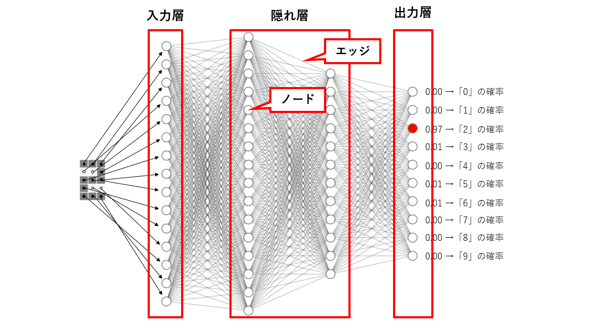

- ノード: 基本単位。脳の神経細胞に相当する部分。ニューロン、ユニットとも呼ばれる。
- エッジ: ノードとノードを接続する線。
- 入力層: 予測したい対象データを受け取る役割を持つ。
- 出力層: 予測結果を出力する役割を持つ。
- 隠れ層: 入力層と出力層の間に位置するすべての層。データを、出力層へと情報伝達する役割を持つ。中間層とも呼ばれる。

## 予測の流れ

NNを構成するノードによって計算処理が行われ、出力値を各ノードへ伝達していく。各ノードへは、すべて同じ値yが伝達される。予測の時点では、重みと閾値は確定している。

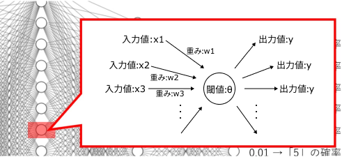

NNでは、重み・閾値・活性化関数の組み合わせによって計算を行う。各エッジが固有の重みを持ち、各ノードは固有の閾値を持つ。また、各層ごとに活性化関数を設定することができる。

- 重み: 各エッジが固有に持つ値。神経細胞における「細胞同士のつながり」に例えることができる。重みが大きいほど、ノードからノードへ情報が伝わりやすくなる。
- 閾値（しきいち）: 各ノードが固有に保持している値。Θ(シータ)。神経細胞における「細胞の敏感度」に例えることができる。閾値が低いほど小さな情報にも反応し、閾値が大きくなるほど情報を無視する役割をもつ。

- 活性化関数: 神経細胞における「細胞の興奮度」に例えることができる。数値の大小に応じて、情報の無効化、減衰、増幅などを行う。

計算方法については意味不明なので省略。

縦5ピクセル×横3ピクセルの数字の画像データから、「0」から「9」のいずれの数値であるかを判定する場合、予測はどのように行われるのでしょう。

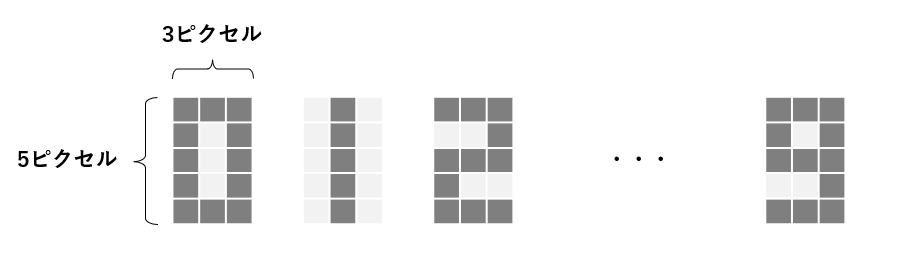

数字の画像データは、縦5ピクセル×横3ピクセルの計15ピクセル。各ピクセルの濃淡を表現する数値 (0−1) をもとに、各ノードでの計算結果が最終的に出力層へアウトプットされる。朝ざっくり。

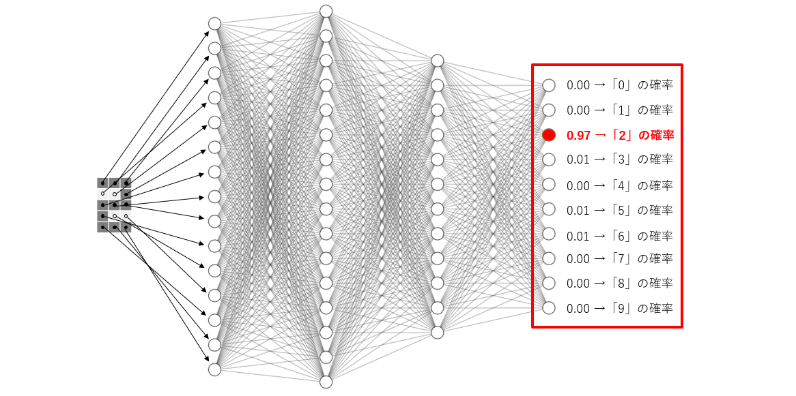

## NN構造の設計

「重み」と「閾値」は学習プロセスによって算出されるが、「ニューラルネットワークの構造」と「活性化関数」については、開発者が決定するもの。このような開発者が決定する設定要素を「ハイパーパラメータ (Hyperparameter)」とよぶ。

### 入力層のノード数

|学習|input|入力層のノード数|
|-|-|-|
|手書き数字の判定|5x3pxの画像データ|15|
|犬or猫の判定|256x256pxの画像データ|65,536|
|家賃の予測|広さ、駅からの距離、築年数|3|

### 出力層のノード数

|学習|output|入力層のノード数|
|-|-|-|
|手書き数字の判定|[0-9]である確率|10|
|犬or猫の判定|[犬猫]である確率|2|
|家賃の予測|家賃価格|1|

### 中間層の層数と各層のノード数

中間層を何列配置するか（層数）、それぞれの層にノードをいくつ配置させるかを決定する必要がある。

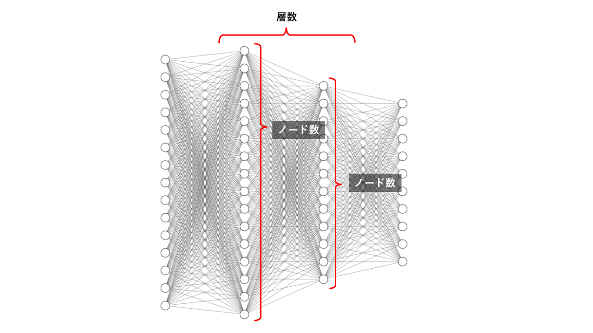

重みや閾値の数が多ければ多いほど、計算負荷が高まり、学習時間が長くなる。一方で、重みや閾値は、予測の計算結果（出力）を調整するパラメータであるため、最終的に高い予測性能を実現することができる。

### 活性化関数

層ごとに、異なる活性化関数を設定が可能。

#### ReLU関数
ReLU関数は、入力値・重み・閾値による計算結果が「0」未満の場合は0、0以上の場合は、そのままの値を出力する。計算が早く、隠れ層でよく利用される。

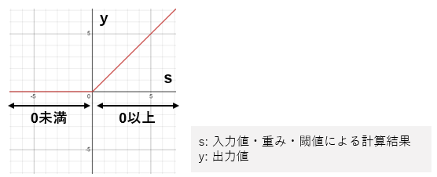

#### Sigmoid関数
シグモイド関数は、出力値が0から1までの値となる。確率を予測する場合に出力層でよく利用される。

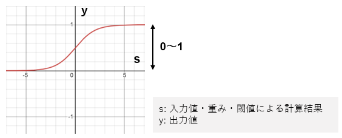

#### tanh関数
tanh関数は、出力値が-1から1までの値となる。隠れ層でよく利用される。

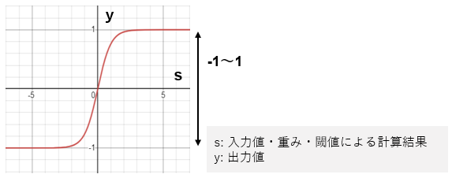

#### Softmax関数
ソフトマックス関数は、同じ層の他のノードと連動しながら計算をする。各ノードの出力値の合計が1となる。カテゴリ分類をする場合に出力層でよく利用される。

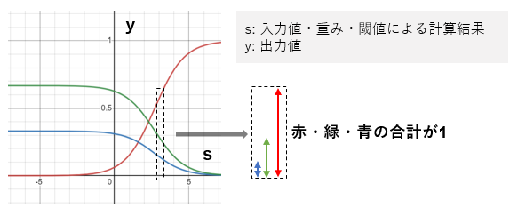

## 学習プロセス
構造や活性化関数は開発者が設定する一方、重みと閾値は、コンピュータが、ニューラルネットワークの学習プロセスの中で決定する。

学習とは、コンピュータに大量のデータを読み込ませ、未知のデータを判断するための法則を見つけ出すこと。

1. 重みと閾値の初期値の設定
    初期値として重みと閾値をランダムもしくはゼロに設定する。
    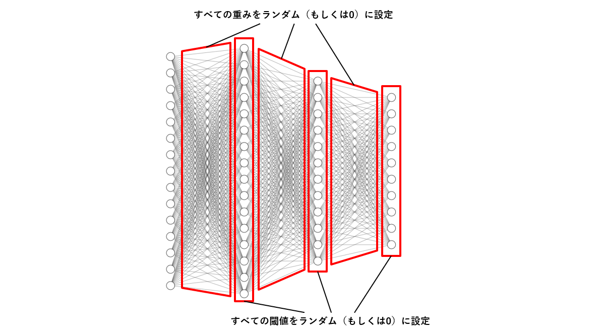
2. ニューラルネットワークに学習用データを投入し、予測値を算出
学習用データを投入し、予測値を算出する。
3. 予測値と理想値との誤差を算出
NNによって算出された予測値と、出力してほしい理想値の誤差の総量を評価する。
4. 誤差を小さくするように重みと閾値を更新
誤差が小さくなるように、少しずつ重みと閾値を更新する。
5. ニューラルネットワークに学習用データを投入し、予測値を算出
重みと閾値を更新したNNに対して、改めて学習用データを投入し、予測値を算出する。
1. 3～5の繰り返し
重みと閾値を更新しても、誤差に変化が無い状態となれば「収束」となる。学習が完了した時点の重みと閾値をつかった完成版ニューラルネットワークのできあがり。

## ハイパーパラメータ
- 学習率：重みと閾値の更新量の程度を制御する値。学習率が高いほど学習時間を短くできる。

- バッチサイズ：学習用データを分割してニューラルネットワークに投入する場合の、分割したデータ数。

- エポック数：学習用データを何度繰り返し利用するかを設定する値。

### バッチサイズとエポック数の関係
学習用データが200、エポック数が5、バッチサイズが10の場合、全エポック分の学習が完了するまで、ニューラルネットワークに100回バッチが投入される。

全データ1000（学習データ200ｘエポック5）／バッチサイズ10 ＝ 100回投入

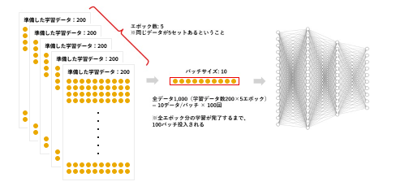