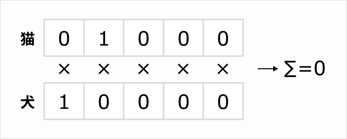
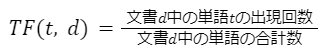
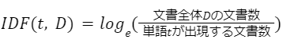

# 自然言語処理

- [自然言語処理とは](#自然言語処理とは)
- [学習モデル](#学習モデル)
  - [BERT](#bert)
  - [GPT](#gpt)
- [テキストの前処理](#テキストの前処理)
  - [テキストのクリーニング](#テキストのクリーニング)
  - [単語分割](#単語分割)
  - [単語の正規化](#単語の正規化)
  - [ストップワードの除去](#ストップワードの除去)
- [分散表現](#分散表現)
  - [One Hot Encoding](#one-hot-encoding)
- [Word2Vecとは](#word2vecとは)
  - [分布仮説](#分布仮説)
  - [Skip-gram](#skip-gram)
  - [CBOW](#cbow)
  - [gensim](#gensim)
- [Word2Vecの発展系ソフトウェア](#word2vecの発展系ソフトウェア)
  - [fastText](#fasttext)
  - [Doc2Vec](#doc2vec)
- [cos類似度とは](#cos類似度とは)
- [形態素解析とは](#形態素解析とは)
- [TF-IDFとは](#tf-idfとは)
  - [TF（Term Frequency）](#tfterm-frequency)
  - [IDF（Inverse Document Frequency）](#idfinverse-document-frequency)
  - [TF-IDF（Term Frequency-Inverse Document Frequency）](#tf-idfterm-frequency-inverse-document-frequency)
- [固有表現抽出](#固有表現抽出)
- [transformer](#transformer)
  - [transformers](#transformers)
- [BERTとは](#bertとは)
- [感情分析とは](#感情分析とは)
  - [ネガポジ分析](#ネガポジ分析)
  - [センチメント分析](#センチメント分析)
- [GPTとは](#gptとは)

## 自然言語処理とは
NLP（Natural Language Processing）とは、自然言語を分析処理する技術のこと。

## 学習モデル

学習モデルとは、機械学習においてデータからパターンや関係性を学習し、その知識を新しいデータに適用して予測や分類を行うための数学的な構造やアルゴリズムのことを指す。これは、人間が経験から学び、新しい状況にその知識を適用するプロセスに類似している。

学習モデルは、入力データを受け取り、それを処理して特定のタスク（画像認識や音声変換など）を実行するための「予測」を出力する。各モデルは大量のデータを使用して「訓練」され、データ内のパターンを「学習」する。訓練過程で、モデルは正しい出力に近づくようにその内部パラメータを自動で調整する。

### BERT
BERT（Bidirectional Encoder Representations from Transformers）は、Googleによって開発された自然言語処理（NLP）のためのモデル。文章の各単語を、その前後の文脈を考慮して文章全体を包括的に理解することができる。

### GPT
GPT（Generative Pre-trained Transformer）は、OpenAIによって開発された自然言語生成（NLG）に特化したモデル。与えられたテキストの続きを予測して生成することができる。

## テキストの前処理

人間が操る自然言語を機械で処理するには前処理が必要。

### テキストのクリーニング
文中の不要な文字を削除する。正規表現などが使われる。

- 改行コード
- URL
- 絵文字、記号
- HTMLタグ

### 単語分割
日本語は英語のように単語が区切られていないため、単語ごとに分割する必要がある。形態素解析手法が使われる。

### 単語の正規化
全角や半角、数字などの形式を統一する処理。

例: 
- これは最新機種のiphoneです。>> これは最新機種のiPhoneです。
- 現在の株価は81,770.0です。 >> 現在の株価は00,000.0です。

### ストップワードの除去
自然言語処理に不要な単語を除去する。

助詞や助動詞「は」「の」「です」「ます」などの機能語は、文章内で出現頻度が高いにも関わらず、計算量や性能に悪影響を及ぼすため、除去される。

## 分散表現
自然言語処理において「単語をどのように処理するか」？
単語を数値に変換する処理のひとつが分散表現。
単語の分散表現では、1つの単語を数百次元のベクトルで表す。

### One Hot Encoding
単語をベクトルで表現する方法のひとつ。

- ある要素のみを1とし、それ以外を0とする
- 各次元にその単語が該当するかどうかを表す
- 次元数は単語の合計数と一致する


この場合、「猫」を [0、1、0、0、0] で表現する。それ以外の単語は0。
単語の数が5個なので次元数は５。

**one-hotエンコーディングの欠点：**

次元数の増加
one-hotエンコーディングは1次元に1単語。そのため、新しい単語が追加されると、ベクトルの次元を増やす必要があり、学習し直す必要が出てくる。

ベクトル間の計算ができない
ベクトル間の計算でその単語同士の距離を測ることで、単語の類似性を数値で表現することが可能。しかし、one-hotエンコーディングを用いた内積計算では0になってしまう。



one-hotエンコーディングの欠点を取り除いたのが**分散表現**。


分散表現では、one-hotエンコーディングでは解決できないベクトル間同士の計算ができる。次元数を増やす必要もない。

## Word2Vecとは

Word2Vecは分布仮説で分散表現を学習するためのソフトウェア。分布仮説は、単語の分散表現を学習するモデルのひとつ。

KingからManを引き、Womanを足すと、Queenが得られるといった演算ができます。


2層のニューラルネットワークのみで構成されており、比較的シンプル(?)な構成。

### 分布仮説
単語の意味はその近傍の単語によって決まる。要するに文脈から推測できるよね。という考え方。

例：
> Washington, DC is the capital of the United States.

ワシントンDCが何か知らなくても、地名だと理解できる。

### Skip-gram
Skip-gramは、中心にある単語から周辺単語を予測する手法。
Word2Vecの内部で分散表現を計算するために使用されているモデルのひとつ。

- 学習手法：教師あり学習
- 入力：中心にある単語
- 出力：周辺の単語

### CBOW
CBOW（Continuous Bag-of-Words Model）は、Skip-gramとは逆に、周辺単語から中心にある単語を予測する手法。

Word2Vecの内部で分散表現を計算するために使用されているモデルのひとつ。

- 学習手法：教師あり学習
- 入力：周辺単語
- 出力：中心の単語

### gensim
gensimとは、Word2Vecを使用するためのPythonのライブラリ。

## Word2Vecの発展系ソフトウェア

### fastText
Word2Vecよりも更に早く、単語学習ができるソフトウェア。標準のCPUでも10分以内に10億語の学習ができるらしい。

### Doc2Vec
文章間の類似度計算、ベクトル計算を可能とするソフトウェア。ニュース記事の類似度を計算し、似ている記事をレコメンドしたりすることができる。

## cos類似度とは
cos類似度とはベクトル空間のモデルで、2つの単語または文章を比較するときに使用される計算手法。

cos類似度の数値範囲は0から1の間。1に近いほど、2つの単語または文章が類似しており、0に近いほど、類似していないことになります。

計算式は意味不明なので省略。

## 形態素解析とは

- 形態素解析：文章を品詞ごとに分割する手法。
- 形態素：意味を有する表現要素の最小単位。

形態素解析ツールに登録済みの辞書情報と照らし合わせながら、文章を構成する形態素を割り出していく。

## TF-IDFとは
TF-IDF（Term Frequency-Inverse Document Frequency）は、情報検索やテキストマイニングにおいて、テキストデータの特徴を数値化するための技術。

### TF（Term Frequency）
TFは、単語が文書にどれだけ頻繁に出現するかを示す指標。

​

例：
```
私はカレーが好きだ。しかし、カレーより寿司のほうが好きです。
```

TFは「寿司」より「カレー」の方が頻繁に出現することを示す。


### IDF（Inverse Document Frequency）
IDFは、文書全体における単語の希少性を数値化する指標。

一般的に、「私」や「です」などの単語は文書に頻繁に登場するにも関わらず、文書を特徴づける要因にはならない。一方、文書の特徴や内容を理解するうえで重要な役割を果たす単語は希少性が高いといえる。

IDFはこのような単語の希少性を数値化し、単語がどれだけ珍しく、文書に特有であるか示すもの。



例：
```
文書全体D
文書1：僕はカレーが好きだ。しかし、カレーより寿司のほうが好きです。
文書2：私はカレーが好きです。中でもカツカレーが一番好きです。
```

IDFは、「カレー」より「寿司」の方が文書に特有の珍しい単語、すなわち希少性が高いことを示す。

### TF-IDF（Term Frequency-Inverse Document Frequency）
TF-IDFは、TFとIDFの積。TF-IDFが大きいほど、文書内での重要度が高く、文書全体における希少性が高いと評価される。

```
TF‐IDF(t,d,D) = TF(t,d) × IDF(t,D)
```

## 固有表現抽出

固有表現とは、地名や人名などの固有名詞、および、数量や日時などを加えたものを指す。与えられた文章から固有表現を抜き出すことを固有表現抽出という。

例：
```
24日夜には中国山地で激しい雪が降り、岡山県内で「顕著な大雪に関する気象情報」が発表された所もありました。
```
「24日夜」「中国山地」「岡山県内」が固有表現。

例えば、チャットbotで返答テキストを決めたり、システムでテキストに含まれる個人情報を隠すような仕組みに固有表現抽出が活用されている。

## transformer

transformerは2017年に発表された「Attention Is All You Need」という論文に掲載された深層学習のモデル。

transformerは並列計算のしやすさを意識した構造になっています。

自然言語処理は、文脈が重要です。

それまでのモデルは回帰型ニューラルネットワーク(RNN)を使った、文を構成する単語に逐次処理をかけていくタイプが主流でした。しかし、transformerは文全体を一度に入力して処理を行います。

今までの自然言語処理のモデルよりも並列処理に長けた特徴を活かして「大量のラベルがついてない」大規模な言語データを使って事前学習されたtransformerベースのモデルがいくつか誕生しました。

事前学習の手法も続々提案され、GPTやBERTといったtransformerベースのモデルが登場しました。

### transformers

- transformerをベースにしたフレームワーク。
- 機械学習、特に自然言語処理を主とした深層学習向けのライブラリ。
- Hugging Face社が公開
- バックエンドにJax, PyTorch, TensorFlowの３つのライブラリをサポート。

## BERTとは

BERT（Bidirectional Encoder Representations from Transformers）は、「Transformerによる双方向のエンコード表現」と訳され、2018年10月にGoogleの中の人が発表した自然言語処理モデル。

検索エンジン以外でも、「天気情報を調べてもらう」「アラームを設定してもらう」など、自然言語の命令は長文で複雑化しやすい傾向にありました。多様化する検索クエリへ対応し、文脈を読むモデルの需要が高まる中で生まれたBERT.

翻訳、文書分類、質問応答など自然言語処理の多様なタスクにおいて、当時の最高スコアを叩き出しました。


## 感情分析とは
感情分析とは、その名の通り、人の感情を分析すること。

学習済みモデルを使用することで、BERTによる感情分析を行うことができる。

感情分析の対象は、テキストのみならず、音声、表情、生体（脳波や脈拍など）など多岐にわたる。

### ネガポジ分析
ネガポジ分析は公開されている「日本語評価極性辞書（単語のネガティブ、ポジティブを数値化したもの）」を使用して、ネガティブかポジティブか判定する方法。。

### センチメント分析
口コミやブログ、SNSなどWeb上のテキストから「主観的な情報（subjective information）」を抽出・定量化する方法。
自然言語処理を用いて文章から感情を読み取り、「肯定的、否定的、中立的」の3つに分類する。

## GPTとは

OpenAI GPTとは2018年に『Improving Language Understanding by Generative Pre-Training』という論文で提案された自然言語処理モデル。

transformerをベースにし、非常に高い精度で文章を生成することができる。最近はGPT-4もでてきたよね。

